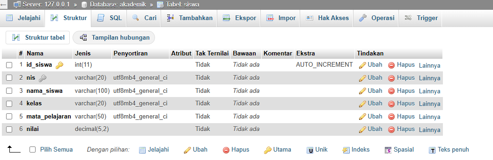
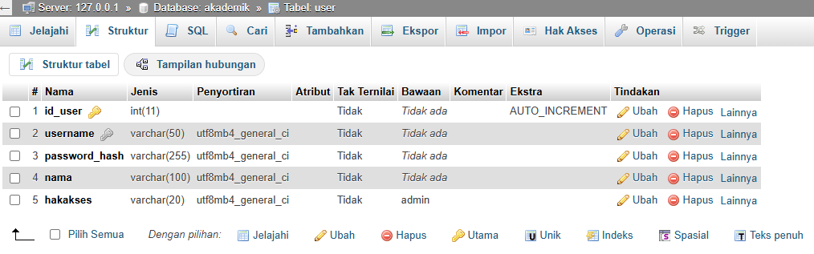
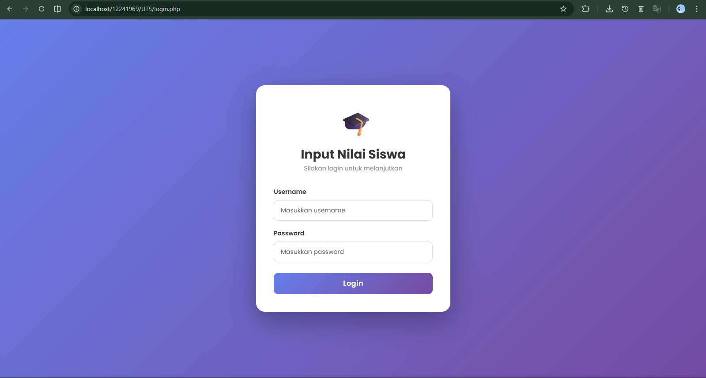
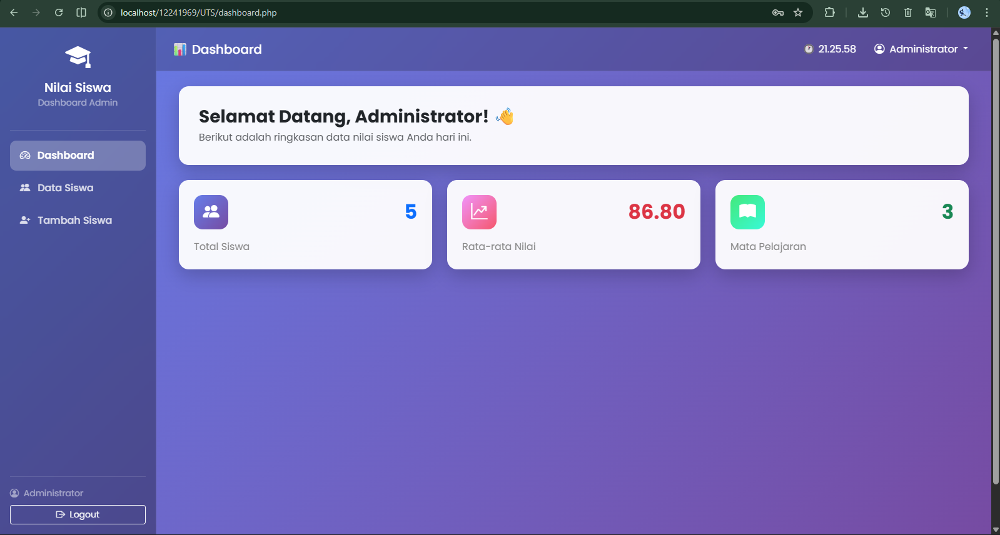
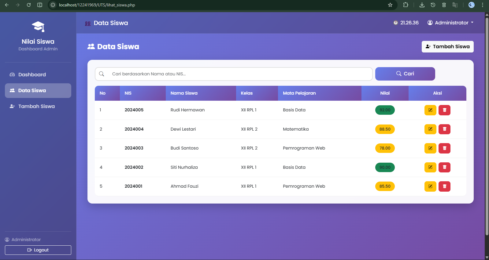
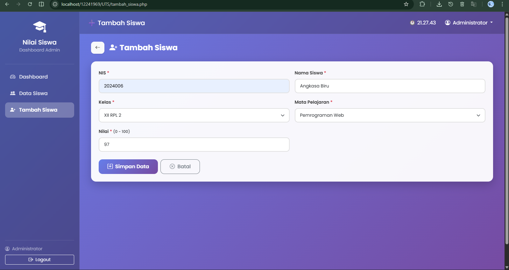
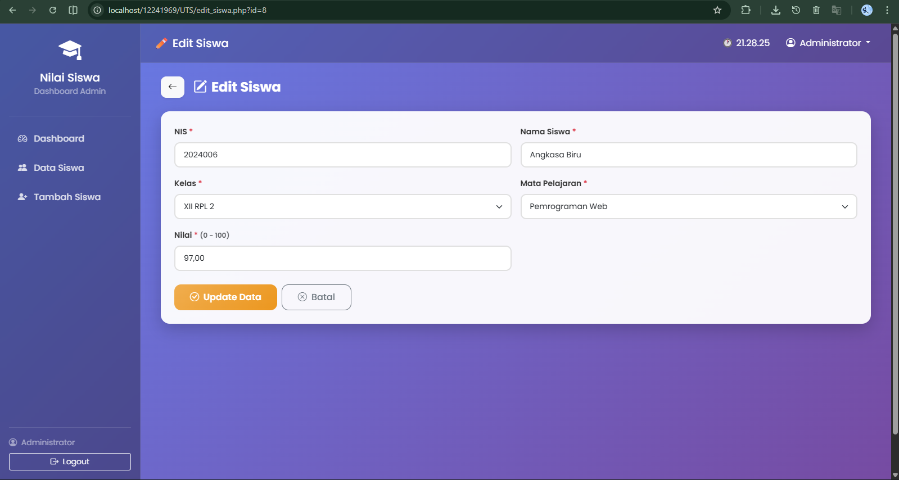
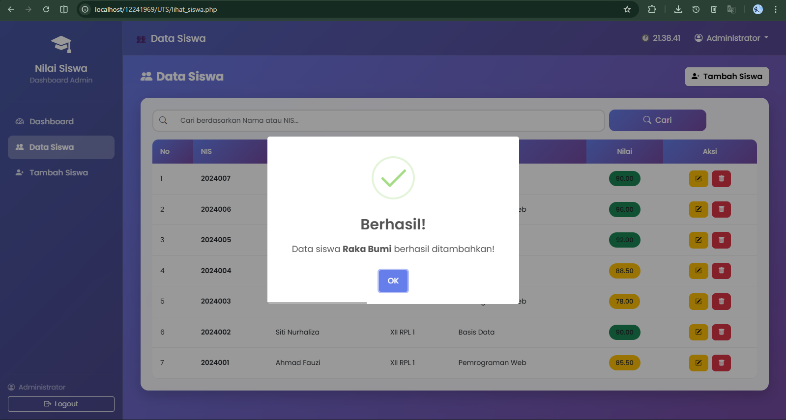
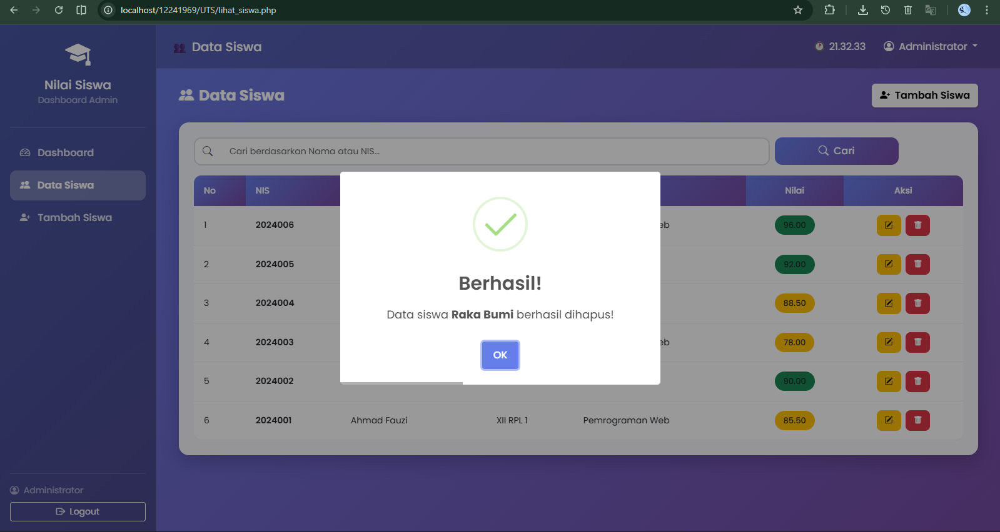

# 📋 LAPORAN UTS PEMROGRAMAN WEB

---

## 🗂️ STRUKTUR DATABASE

### Database: `akademik`

> 📸 Screenshot 1: Struktur tabel dari phpMyAdmin
> 
> 
> 

---

## 📂 STRUKTUR FOLDER & FILE

```
📁 uts-web-nilai-siswa/
│
├── 📄 koneksi.php          # Koneksi database
├── 📄 session_check.php    # Proteksi halaman (session)
├── 📄 login.php            # Halaman form login
├── 📄 proses_login.php     # Proses verifikasi login
├── 📄 logout.php           # Proses logout
├── 📄 dashboard.php        # Halaman utama
├── 📄 sidebar.php          # Komponen navigasi sidebar
├── 📄 navbar.php           # Komponen header/navbar
├── 📄 lihat_siswa.php      # Tabel data siswa + pencarian
├── 📄 tambah_siswa.php     # Form tambah data siswa
├── 📄 edit_siswa.php       # Form edit data siswa
├── 📄 hapus_siswa.php      # Proses hapus data siswa
├── 📄 style.css            # Custom CSS tambahan
├── 📄 database.sql         # File export database
└── 📄 LAPORAN_UTS.md       # File laporan
```

---

## 🔑 INFORMASI LOGIN (UNTUK PENGUJI)

| Keterangan   |                    Detail                   |
|--------------|---------------------------------------------|
| URL          | `http://localhost/namafolder/UTS/login.php` |
| Username     |                   `admin`                   |
| Password     |                 `admin123`                  |

> Catatan: Password disimpan dalam bentuk hash di database. Gunakan username dan password di atas untuk login.

---

## 📸 TAMPILAN HASIL WEBSITE

### 1. Login
> 

### 2. Dashboard
> 

### 3. Data Siswa
> 

### 4. Tambah Siswa
> 

### 5. Edit Siswa
> 

### 6. Konfirmasi Hapus
> 

### 7. Notifikasi Sukses
> 

> 

> 

---

## 📎 LAMPIRAN

- Source code lengkap (GitHub)
- File SQL database (`akademik.sql`)

---
